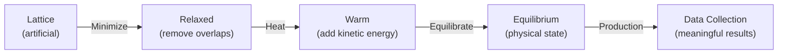
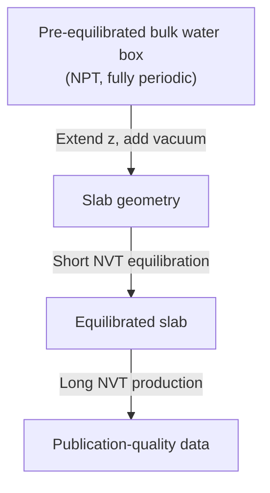

# Variant A Simulation Diagnosis

## 🔍 What Went Wrong and Why

### Issue 1: Density = 0.4487 g/cm³ (Expected ~1.0)

**This is actually expected behavior** — but the script design makes it misleading.

LAMMPS reports **system-average density** = total mass / total box volume. Your setup:

| Parameter | Value |
|---|---|
| Total box | 30 × 30 × **120** Å = 108,000 ų |
| Water slab | 29 × 29 × **60** Å ≈ 50,460 ų |
| Water fraction of box | ~47% |

The water slab only occupies **47% of the box** — the rest is vacuum. So:
- System-average density: 1.0 × 0.47 ≈ **0.47 g/cm³** ✓ (matches your output)
- Within the slab itself, density is actually ~0.96 g/cm³ (a density profile along z would show this)

> [!IMPORTANT]
> **The density LAMMPS reports in thermo output is meaningless for slab geometries.** You need the z-density profile (which your `fix ave/chunk` was computing) to see the real water density inside the slab.

---

### Issue 2: Negative Pressure

In slab geometry, pressure is **expected to be negative and anisotropic**:

```
P_total = (Pxx + Pyy + Pyy) / 3
```

- **Pxx, Pyy** (in-plane): roughly zero or slightly positive — behave like bulk water
- **Pzz** (perpendicular to interface): **strongly negative** — because of the missing interactions across the vacuum gap

The result is a negative average pressure. **This is normal and correct for slab simulations with vacuum.** The average scalar pressure is not a meaningful quantity here.

> [!TIP]  
> For interfacial systems, focus on the **pressure tensor components** individually, not the scalar average. Surface tension itself is computed from the pressure anisotropy: γ = ½ Lz (Pzz − ½(Pxx + Pyy)), which your script already does correctly.

---

### Issue 3: Minimization Blew Up

From the output:
```
Energy initial → next-to-last → final:
  1492.2  →  -13716.4  →  177,365,258.3   ← EXPLODED
Stopping criterion: linesearch alpha is zero
```

The minimization went well initially (energy dropped from 1492 to −13716) but then **catastrophically blew up** in the last step. 

**Root cause**: `fix shake` is incompatible with minimization. LAMMPS even warns about this:
> WARNING: Using fix shake with minimization. Substituting constraints with harmonic restraint forces.

The harmonic restraints it substitutes are approximate and can cause force discontinuities that confuse the minimizer.

---

## 🏗️ Why Multiple Stages? (And When You Actually Need Them)

### The Physics Reason

You're placing water molecules on a **simple cubic lattice** — this is a completely artificial arrangement that has nothing to do with the equilibrium structure of liquid water. The stages exist to safely transition from this artificial state to physical reality:



| Stage | Purpose | What happens if skipped |
|-------|---------|------------------------|
| **Minimize** | Remove atomic overlaps and bad contacts | Atoms fly apart, simulation crashes |
| **Heat** | Gradually add kinetic energy | Sudden 300K velocities → molecules blast apart |
| **Equilibrate** | Let structure relax to realistic liquid | Data reflects artificial initial conditions, not real physics |
| **Production** | Collect meaningful data | N/A |

### For a Research Project: The Better Approach

For research-quality simulations, you should **not** be building from a lattice at all. The standard approach is:



**Step 1**: Equilibrate bulk water separately with **NPT** (all periodic boundaries, no vacuum) to get the correct density (~1.0 g/cm³). This is a one-time cost.

**Step 2**: Take the equilibrated box, extend the z-dimension to add vacuum, switch to NVT.

**Step 3**: Short equilibration to reform the interfaces.

**Step 4**: Long production run.

This eliminates the need for aggressive minimization and heating, because the water is already in a physically realistic state.

---

## 🐛 Specific Bugs in variant_a.lammps

### Bug 1: SHAKE + Minimization
```diff
-fix             fSHAKE water shake 1.0e-4 100 0 b 1 a 1
-minimize        1.0e-4 1.0e-6 500 5000
+# Option A: Minimize WITHOUT shake, then add it
+minimize        1.0e-4 1.0e-6 500 5000
+fix             fSHAKE water shake 1.0e-4 100 0 b 1 a 1
+
+# Option B: Use soft potential for initial relaxation
+# pair_style soft 5.0
+# ... minimize ... then switch to real potential
```

### Bug 2: Ewald is 10× Slower Than PPPM
```diff
-kspace_style    ewald 1.0e-4
+kspace_style    pppm 1.0e-4
```
Your log showed Ewald takes **95% of compute time**. PPPM scales as O(N log N) vs Ewald's O(N^1.5). For 4860 atoms this is significant — you'll see a 5-10× speedup.

### Bug 3: `pair_modify tail yes` with Non-Periodic Boundaries
```
WARNING: Using pair tail corrections with non-periodic system
```
Tail corrections assume a uniform distribution beyond the cutoff — this assumption is **wrong** at interfaces. The correction artificially shifts the energy.
```diff
-pair_modify     tail yes
+pair_modify     tail no    # NOT valid for interfacial systems
```

### Bug 4: Low Density Within the Slab

The `lattice sc 3.1` gives ~0.96 g/cm³ within the slab — close but not right. At NVT (constant volume), the water cannot adjust its density. You should:
- First run NPT to get correct density
- OR use `lattice sc 3.07` for slightly closer initial density

### Bug 5: No Velocity Zeroing After Minimization

After minimization, atoms have residual velocities from the artificial relaxation. These should be removed:
```diff
+velocity        water zero linear
+velocity        water zero angular
 velocity        water create 100.0 87287 dist gaussian
```

---

## ✅ Recommended Corrected Approach

For a **research-grade** air-water interface simulation, I recommend restructuring into two scripts:

### Script 1: `bulk_water_equilibration.lammps`
- Fully periodic box (p p p)
- Create water on a lattice
- Minimize (without SHAKE)
- Heat under NVT
- Equilibrate under **NPT** at 300K, 1 atm → density converges to ~1.0 g/cm³
- Write data file of equilibrated bulk water

### Script 2: `slab_production.lammps`  
- Read the equilibrated bulk water data
- Change boundary to `p p f` (or `p p p` with large vacuum and slab correction)
- Change box to add ~40-60 Å vacuum above and below
- **Short** NVT equilibration (5-10 ps) to let interfaces form
- Long NVT production (100+ ps for research)
- Collect density profiles, surface tension, trajectory

> [!CAUTION]
> For publication-quality surface tension of SPC/E water, you need **at minimum** 500 ps–1 ns of production time, not 10 ps. The 10 ps test run is fine for validation but will give noisy, unreliable surface tension values.

---

## Summary of What to Fix

| Issue | Severity | Fix |
|-------|----------|-----|
| SHAKE during minimization | 🔴 Critical | Move SHAKE after minimize |
| Ewald instead of PPPM | 🟡 Performance | Switch to `pppm` |
| `pair_modify tail yes` at interface | 🔴 Wrong physics | Set `tail no` |
| Building from lattice (no NPT) | 🟡 Non-ideal | Use 2-script approach |
| 10 ps production | 🔴 Insufficient | Need 500+ ps for research |
| No velocity zeroing post-minimize | 🟡 Minor | Add `velocity zero` |

Would you like me to write the corrected two-script approach?
