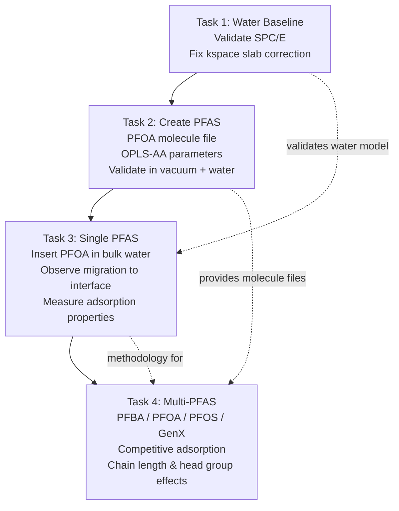

# PFAS at the Air-Water Interface — Simulation Plan & Physics Reasoning

> **Date**: 2026-03-02  
> **Context**: This document brainstorms the full simulation pipeline for studying PFAS behavior at air-water interfaces using LAMMPS. It covers molecular positioning logic, energy interaction frameworks, and step-by-step planning for each task.

---

## Table of Contents

1. [Task 1: Air-Water Interface Simulation](#task-1-air-water-interface-simulation)
2. [Task 2: Creating PFAS Molecules in LAMMPS](#task-2-creating-pfas-molecules-in-lammps)
3. [Task 3: Inserting PFAS into Water Bulk](#task-3-inserting-pfas-into-water-bulk)
4. [Task 4: Multiple PFAS Categories — Comparative Study](#task-4-multiple-pfas-categories--comparative-study)
5. [Cross-Cutting: Energy Interactions Deep Dive](#cross-cutting-energy-interactions-deep-dive)
6. [Recommended LAMMPS Packages](#recommended-lammps-packages)

---

## Task 1: Air-Water Interface Simulation

### What We're Building

A slab of liquid water suspended in vacuum. The vacuum on both sides of the slab represents "air." This slab geometry naturally creates **two air-water interfaces** — one at the top and one at the bottom of the water slab.

### How I Think About Molecular Positions

```
z-axis (Å)
  120 ┌─────────────────────┐
      │     VACUUM (air)     │  ← No molecules here
   90 ├─────────────────────┤  ← Upper interface
      │                     │
      │   LIQUID WATER       │  ← Bulk-like density (~1.0 g/cm³)
      │   (SPC/E molecules)  │
      │                     │
   30 ├─────────────────────┤  ← Lower interface
      │     VACUUM (air)     │  ← No molecules here
    0 └─────────────────────┘
       x: 0–30 Å  y: 0–30 Å
```

**Why this geometry?**
- The **elongated z-dimension** (120 Å) relative to x,y (30 Å) creates enough vacuum space so the two interfaces don't interact with each other
- **Periodic boundaries** (p p p) mean the water slab effectively sees images of itself in x and y → simulates an infinite flat slab
- The water occupies **z = 30–90 Å**: 60 Å of liquid. This gives ~20 Å of bulk-like water in the center (away from both interfaces), which is enough to avoid finite-size artifacts
- The vacuum regions (0–30 Å and 90–120 Å) are each 30 Å, which must exceed the LJ+Coulomb cutoff (10 Å) by a comfortable margin to prevent the slab from interacting with its periodic image through the vacuum

**Why SPC/E water?**
- SPC/E reproduces key properties we need: bulk density (~0.998 g/cm³), surface tension (~61 mN/m), and diffusion coefficient
- It's a **rigid 3-site model** (1 oxygen, 2 hydrogens), making it computationally efficient while accurate enough for interfacial properties
- The charges (O: −0.8476e, H: +0.4238e) are tuned to reproduce the average polarization of water in the liquid phase — this is the "Extended" part of SPC/E and is why it beats plain SPC for interfacial simulations

### Energy Interactions in the Water System

| Interaction | Type | Parameters | Physical Meaning |
|---|---|---|---|
| O–O | Lennard-Jones 12-6 | ε = 0.1553 kcal/mol, σ = 3.166 Å | van der Waals repulsion + dispersion |
| O–H, H–H | LJ | ε = 0, σ = 0 | No LJ on hydrogens (SPC/E convention) |
| All charged pairs | Coulomb | q_O = −0.8476e, q_H = +0.4238e | Electrostatics → hydrogen bonding emerges |
| O–H bond | SHAKE constraint | r₀ = 1.0 Å | Rigid bond (no vibrational DOF) |
| H–O–H angle | SHAKE constraint | θ₀ = 109.47° | Tetrahedral angle preserved |

**Why Ewald/PPPM for kspace?**
- Water molecules are charged → long-range Coulomb interactions extend to infinity
- Simple cutoff truncation of Coulomb would create serious artifacts at interfaces (charge imbalance)
- Ewald summation splits the Coulomb sum into short-range (real space) + long-range (reciprocal space), giving correct electrostatics even with periodic boundaries

> [!IMPORTANT]
> For slab geometries, we **must** use `kspace_modify slab 3.0` to insert a vacuum correction. Without it, the 3D-periodic Ewald sum "sees" the slab's periodic image in z and produces wildly incorrect surface tensions (~641 mN/m instead of ~61 mN/m). The slab correction multiplier (3.0) should be ≥ 3× the box dimension along z.

### Validation Targets

| Property | SPC/E Literature Value | What It Tells Us |
|---|---|---|
| Bulk density | ~0.998 g/cm³ | Water packing is correct |
| Surface tension | ~61 mN/m | Interface energetics are correct |
| O-O RDF peak | ~2.75 Å | Hydrogen bond geometry is right |
| Interfacial width (10-90) | ~3–4 Å | How sharp is the liquid-vapor boundary |

### Current Status

Our existing simulation (`air_water_interface.lammps`) achieves **0.956 g/cm³ density** (close to target). Surface tension needs the slab correction fix. Once this baseline is validated, we can confidently add PFAS molecules knowing the water behavior is physically correct.

---

## Task 2: Creating PFAS Molecules in LAMMPS

### The Physics of PFAS Structure

PFAS molecules are **amphiphilic surfactants**: they have a **hydrophilic head group** (attracted to water) and a **hydrophobic fluorinated tail** (repelled by water, attracted to air/vacuum).

```
Hydrophobic tail                  Hydrophilic head
─── repels water ───               ─── loves water ───

 F F F F F F F F                      O⁻
 │ │ │ │ │ │ │ │                      ║
─C─C─C─C─C─C─C─C──── head group ────C═O    (carboxylate, e.g. PFOA)
 │ │ │ │ │ │ │ │                      │
 F F F F F F F F                     O⁻

         or

 F F F F F F F F                      O⁻
 │ │ │ │ │ │ │ │                      ║
─C─C─C─C─C─C─C─C──── head group ──── S═O   (sulfonate, e.g. PFOS)
 │ │ │ │ │ │ │ │                      ║
 F F F F F F F F                      O⁻
```

### Force Field Selection: OPLS-AA

I advise using **OPLS-AA (Optimized Potentials for Liquid Simulations — All Atom)** because:

1. **Validated for organics in liquid phase**: OPLS-AA parameters are specifically fit to reproduce experimental liquid-state properties (densities, heats of vaporization)
2. **Fluorine parameters exist**: the Watkins-Jorgensen OPLS-AA extension provides specific parameters for perfluoroalkyl chains (C–F bonds, F-C-F angles, dihedral torsions)
3. **Compatible with SPC/E**: OPLS-AA was designed to work with common water models. Cross-interactions between PFAS and water are computed via standard Lorentz-Berthelot mixing rules
4. **LigParGen**: this online tool can generate OPLS-AA parameters for arbitrary molecules including PFAS → outputs LAMMPS-compatible files

### How I Think About PFAS Energy Interactions

Each PFAS molecule introduces these new interaction types:

| New Interaction | Force Field Term | Physical Meaning |
|---|---|---|
| C–F bond | Harmonic bond | Extremely strong bond (C–F ~116 kcal/mol bond energy) |
| C–C bond (in chain) | Harmonic bond | Backbone flexibility |
| F–C–F angle | Harmonic angle | Maintains tetrahedral geometry of CF₂ |
| C–C–C–C dihedral | OPLS torsion | Controls chain stiffness/helical structure |
| F···Ow | LJ (cross) | Fluorine–water oxygen: **weak**. This is why tails are hydrophobic |
| C(head)–Ow | LJ + Coulomb | Head group–water: **strong** electrostatic attraction |
| COO⁻···Hw | Coulomb | Carboxylate–water hydrogen: hydrogen bonding at head |

**Critical insight**: The C–F bond is one of the strongest single bonds in organic chemistry. The fluorine atoms, despite being electronegative, create a **nonpolar shell** around the carbon chain because the dipoles cancel in a symmetric CF₂ group. This makes the perfluoroalkyl tail **both hydrophobic and lipophobic** (even more nonpolar than a hydrocarbon chain).

### Building the Molecule File

For each PFAS, we need a `.mol` template or a LAMMPS data file section containing:

1. **Atom coordinates**: from quantum chemistry optimization (e.g., Avogadro or GAMESS)
2. **Atom types**: Oxygen, Carbon (several types: carbonyl-C, chain-C), Fluorine, Hydrogen (if any)
3. **Partial charges**: from quantum mechanics (AM1-BCC or RESP fitting) or from OPLS-AA defaults via LigParGen
4. **Bond topology**: which atoms are bonded
5. **Angle and dihedral definitions**: automatically generated from connectivity

### Recommended Workflow

```
Step 1: Draw molecule structure (Avogadro / SMILES)
        ↓
Step 2: Optimize geometry (AM1 or DFT in Gaussian/GAMESS)
        ↓
Step 3: Generate OPLS-AA parameters (LigParGen)
        ↓
Step 4: Convert to LAMMPS format (.mol or data file)
        ↓
Step 5: Validate single-molecule in vacuum (energy minimization)
        ↓
Step 6: Validate single-molecule in bulk water (solvation energy check)
```

---

## Task 3: Inserting PFAS into Water Bulk

### The Key Question: Where to Place PFAS Initially?

This is a surprisingly important decision. Here's my reasoning:

#### Option A — Place in Bulk Water (Center of Slab) ✅ **Recommended**

```
z-axis
  120 ┌───────────────────────┐
      │       VACUUM          │
   90 ├───────────────────────┤ Upper interface
      │       water           │
      │                       │
   60 │  ★ PFAS placed HERE ★ │ ← Center of water slab
      │                       │
      │       water           │
   30 ├───────────────────────┤ Lower interface
      │       VACUUM          │
    0 └───────────────────────┘
```

**Why bulk placement is scientifically better:**
- It answers the question "How does PFAS **find** the interface from bulk solution?"
- We can measure the **transport timescale**: how long does the PFAS take to diffuse from bulk to an interface?
- We can observe the **adsorption event** in real time — the molecule sampling different orientations as it approaches the interface
- This mimics the real-world scenario: PFAS contamination enters groundwater (bulk) and then partitions to interfaces
- **No bias** in the final state — the molecule finds its equilibrium position naturally

**Practical concerns:**
- PFAS must be **inserted without overlapping** water molecules → use `create_atoms` with a `delete_atoms overlap` pass, or use `fix deposit`, or pre-carve a cavity
- After insertion, **re-equilibrate** the water around the PFAS molecule before production run (the cavity disrupts local water structure)
- For LAMMPS: insert PFAS → energy minimize → short NPT to relax pressure → NVT equilibration → production

#### Option B — Place at Interface (Pre-Positioned)

This is appropriate if you want to study **interfacial properties** without waiting for the migration event. Faster to reach steady-state, but you lose information about the adsorption pathway.

### What to Observe: The Adsorption Journey

Once placed in bulk water, here's what we expect to see at the molecular level:

```
Time ─────────────────────────────────────────────────►

Phase 1: Bulk Solvation          Phase 2: Migration        Phase 3: Interfacial
(0 – ~hundreds of ps)           (~hundreds to ns)          Equilibrium

 water water water         water water water         vacuum   vacuum
 water PFAS water    →     water water PFAS    →     ─ ─ ─F─F─F─F─F  ← tail in air
 water water water         water water water               │
                                                     water-COO⁻ water  ← head in water
                                                     water water water

 Head solvated,             PFAS diffuses             Tail expels water,
 tail creates a             toward interface           head stays hydrogen-
 "cavity" in water          (thermodynamically         bonded. System
 (unfavorable)              driven)                    has LOWER free energy.
```

### Energy Landscape Along the Journey

| State | Energy Contribution | Sign | Magnitude |
|---|---|---|---|
| Tail in bulk water | Creates cavity (breaks H-bonds) | **+** unfavorable | ~10–30 kcal/mol depending on chain length |
| Head in bulk water | Solvated by H-bonds + electrostatics | **−** favorable | ~20–40 kcal/mol |
| Tail at interface (air) | No cavity needed; tail is in vacuum | **0** neutral | Reference state |
| Head at interface (water side) | Still solvated by H-bonds | **−** favorable | Only slightly less than in bulk |
| **Net driving force** | ΔG(bulk→interface) | **−** favorable | ~5–15 kcal/mol (strong driving force) |

**Key takeaway**: The driving force for PFAS adsorption is primarily the **elimination of the unfavorable hydrophobic tail cavity**. The head group barely changes its solvation energy. This is why longer-chain PFAS (bigger tail = bigger cavity cost) adsorb more strongly.

### Analysis Metrics

| Metric | How to Compute in LAMMPS | What It Tells You |
|---|---|---|
| Density profile (z) | `fix ave/chunk` with `chunk/atom bin/1d z` | Where is the PFAS located? How does water density change near PFAS? |
| PFAS center-of-mass z(t) | `compute com/chunk` on PFAS group | Track migration from bulk to interface over time |
| Orientation angle | Angle between tail-to-head vector and z-axis | θ → 0° means tail pointing straight up into air |
| Hydrogen bonds | `compute hbond` or manual distance/angle criterion | How many H-bonds does the head maintain? |
| Surface tension | Pressure tensor: γ = ½Lz(Pzz − ½(Pxx + Pyy)) | How much does PFAS reduce surface tension? |
| Radial Distribution Function | `compute rdf` for F–Ow, F–Hw, COO–Hw | Local solvation structure around the molecule |

### Practical LAMMPS Insertion Strategy

```lammps
# --- Option 1: Molecule command with overlap deletion ---
# After creating water slab:
molecule        pfoa_mol pfoa.mol
create_atoms    0 single 15.0 15.0 60.0 mol pfoa_mol 54321
delete_atoms    overlap 2.0 pfas_group water_group

# --- Option 2: Using fix deposit (more automated) ---
fix             insert pfas_type deposit 1 0 1 54321 &
                region waterbox near 2.0 mol pfoa_mol

# --- Option 3: Pre-build combined data file ---
# Use Moltemplate or PACKMOL to create a data file with water + PFAS
# Read the entire system: read_data combined_system.data
```

---

## Task 4: Multiple PFAS Categories — Comparative Study

### Categories to Simulate

I recommend studying these specific PFAS molecules, chosen to systematically vary **chain length** and **head group type**:

#### Group A: Varying Chain Length (Carboxylic Acids — PFCAs)

| Molecule | Formula | Chain C atoms | Category | Expected Behavior |
|---|---|---|---|---|
| PFBA | CF₃(CF₂)₂COOH | 4 (short) | Short-chain PFCA | Weaker adsorption, more soluble in bulk |
| PFHxA | CF₃(CF₂)₄COOH | 6 (medium) | Medium-chain PFCA | Moderate adsorption |
| PFOA | CF₃(CF₂)₆COOH | 8 (long) | Long-chain PFCA | Strong adsorption, dominant at interface |
| PFDA | CF₃(CF₂)₈COOH | 10 (long) | Long-chain PFCA | Very strong adsorption, slow migration |

#### Group B: Varying Head Group (at Fixed Chain Length ≈ C8)

| Molecule | Formula | Head Group | Expected Behavior |
|---|---|---|---|
| PFOA | CF₃(CF₂)₆COOH | Carboxylate (−COO⁻) | Reference compound |
| PFOS | CF₃(CF₂)₇SO₃H | Sulfonate (−SO₃⁻) | Stronger head solvation → even more surface active |
| 8:2 FTOH | CF₃(CF₂)₇CH₂CH₂OH | Alcohol (−OH) | Weaker head, nonionic → different adsorption |
| GenX (HFPO-DA) | CF₃CF₂OCF₂COOH | Ether + Carboxylate | Branched → disrupts packing, different orientation |

### How I Think About Competitive Adsorption

When multiple PFAS types are in the same solution, they **compete for limited interfacial area**. Here's the physics:

```
                    SINGLE PFAS                    MULTI-COMPONENT MIXTURE
              ┌─────────────────────┐          ┌─────────────────────┐
 vacuum       │ │ │ │ │ │ │ │ │ │ │ │          │ A B A B A A B A B A │
              │ ↑ ↑ ↑ ↑ ↑ ↑ ↑ ↑ ↑ ↑ │          │ ↑ ↑ ↑ ↑ ↑ ↑ ↑ ↑ ↑ ↑ │
 ─────────────├─┼─┼─┼─┼─┼─┼─┼─┼─┼─┤──────────├─┼─┼─┼─┼─┼─┼─┼─┼─┼─┤─────
 water        │ ● ● ● ● ● ● ● ● ● ● │          │ ● ● ● ● ● ● ● ● ● ● │
              │                       │          │   some B displaced  │
              │  All same PFAS        │          │   to bulk by A      │
              └───────────────────────┘          └───────────────────────┘
                                                  A = longer chain (wins)
                                                  B = shorter chain (loses)
```

**Who wins the interface?** The molecule with the **largest free energy of adsorption** (ΔG_ads). This is controlled by:

1. **Chain length**: Longer fluorinated tail → more cavity energy saved → stronger ΔG_ads → wins
2. **Head group affinity**: Stronger head–water interaction → more stable at the interface → wins
3. **Molecular shape**: Linear chains pack efficiently at the interface. Branched molecules (GenX) pack poorly → weaker adsorption per molecule but may disrupt packing of linear PFAS
4. **Concentration ratio**: At very high concentrations of a weaker PFAS, it can still dominate by sheer numbers (entropy contribution to free energy)

### Simulation Design Matrix

| Simulation Run | PFAS A | Number | PFAS B | Number | Total PFAS |
|---|---|---|---|---|---|
| Run 1: Short vs long | PFBA (C4) | 5 | PFOA (C8) | 5 | 10 |
| Run 2: Carboxylate vs sulfonate | PFOA (C8, COO⁻) | 5 | PFOS (C8, SO₃⁻) | 5 | 10 |
| Run 3: Linear vs branched | PFOA (C8) | 5 | GenX (branched) | 5 | 10 |
| Run 4: Equal mixture of three | PFBA | 3 | PFOA | 3 | 9 |
|  | | | PFOS | 3 | |
| Run 5: Concentration sweep | PFOA | 2, 5, 10, 20 | — | — | Variable |

### Analysis Framework for Multi-Component Systems

| Analysis | Method | Purpose |
|---|---|---|
| **Interfacial composition** | Count each PFAS type within ±5 Å of Gibbs dividing surface | Who ends up at the interface? |
| **Displacement kinetics** | Track which molecule arrives at interface first and whether it gets displaced | Is there a "first to arrive, last to leave" effect? |
| **Packing efficiency** | Area per molecule at interface | Do longer chains pack more tightly? |
| **Surface tension reduction** | Pressure tensor method | Additive or synergistic effects? |
| **Orientation maps** | Average tilt angle for each PFAS type at interface | Do different PFAS orient differently when mixed? |
| **Segregation** | Lateral RDF between PFAS head groups at interface | Do PFAS types cluster or mix uniformly at the interface? |

---

## Cross-Cutting: Energy Interactions Deep Dive

### The Full Energy Equation

The total potential energy in our simulation is:

```
U_total = U_bonds + U_angles + U_dihedrals + U_LJ + U_Coulomb
```

Each term plays a distinct physical role:

### 1. Bonded Interactions (Intramolecular)

```
U_bond    = K_b (r − r₀)²           ← Keeps atoms at correct bond length
U_angle   = K_θ (θ − θ₀)²           ← Maintains bond angles
U_dihedral = Σ Kₙ [1 + cos(nφ − δ)] ← Controls chain conformation (gauche vs trans)
```

**Why they matter for PFAS:**
- The **C–F bond** (K_b very large) keeps fluorines rigidly attached → the tail is stiff
- **Dihedral terms** in perfluoroalkyl chains favor a **helical conformation** (not the all-trans zigzag of hydrocarbons). This is because F atoms are larger than H, so adjacent CF₂ groups twist slightly to reduce steric clash
- The helix makes the PFAS tail ~15–17° per CF₂ unit, creating a rod-like structure that packs efficiently at interfaces

### 2. Lennard-Jones (van der Waals) Interactions

```
U_LJ = 4ε [(σ/r)¹² − (σ/r)⁶]

  r < σ : Strong repulsion (Pauli exclusion)
  r = σ : Zero energy crossing
  r = 2^(1/6)σ : Energy minimum (attraction)
  r > 3σ : Negligible
```

**Key LJ pairs in our system:**

| Pair | ε (kcal/mol) | σ (Å) | Physical role |
|---|---|---|---|
| Ow–Ow | 0.1553 | 3.166 | Water–water cohesion |
| F–F | ~0.053 | ~2.95 | Fluorine–fluorine (weak) |
| F–Ow | ~0.091* | ~3.06* | Fluorine–water: **weak attraction** → hydrophobicity |
| C(CF₂)–Ow | ~0.08* | ~3.3* | Chain carbon–water: weak → hydrophobic |
| C(COO)–Ow | ~0.10* | ~3.3* | Head carbon–water: moderate |

*\*Cross-interaction values from Lorentz-Berthelot mixing: σ_ij = (σ_i + σ_j)/2, ε_ij = √(ε_i × ε_j)*

**The hydrophobic effect emerges from LJ**: The F–Ow interaction is weaker than Ow–Ow. So water molecules near a fluorinated tail lose more hydrogen bonding energy than they gain from van der Waals attraction to fluorine. The system minimizes energy by **expelling the tail** from water.

### 3. Electrostatic Interactions (Coulomb)

```
U_Coulomb = (q_i × q_j) / (4πε₀ r_ij)
```

**This is the dominant long-range interaction**. Critical pairs:

| Pair | Charges | Effect |
|---|---|---|
| Ow–Hw (water–water) | (−0.85)(+0.42) | Hydrogen bonding network |
| COO⁻ – Hw | (~−0.8)(+0.42) | **Strong**: anchors PFAS head in water |
| SO₃⁻ – Hw | (~−0.65)(+0.42) | **Strong**: sulfonate head is well-solvated |
| CF₂ – Ow | (~+0.18)(−0.85) | **Weak**: slight charge on C, but heavily screened |
| F – Hw | (~−0.12)(+0.42) | **Very weak**: despite F being electronegative, charges cancel in CF₂ groups |

### Energy Balance Summary

```
                              In Bulk Water           At Interface
                              ───────────             ────────────
Tail (CF₂ chain):
  LJ with water              + (unfavorable)          0 (no water contact)
  Coulomb with water          ≈ 0 (nearly neutral)    ≈ 0
  Cavity formation penalty    ++ (very unfavorable)    0

Head (COO⁻ / SO₃⁻):
  LJ with water              − (favorable)            − (still in water)
  Coulomb / H-bonds           −−− (very favorable)     −− (fewer partners, 
                                                            but still strong)

Net effect:                   The cavity cost dominates → PFAS is DRIVEN
                              to the interface where the tail can escape
                              water while the head stays solvated.
```

---

## Recommended LAMMPS Packages

### For Best Real-World Accuracy

| Need | LAMMPS Package/Feature | Why |
|---|---|---|
| **Water model** | SPC/E (current) | Best balance of accuracy and speed for interfacial properties |
| **PFAS force field** | OPLS-AA via `pair_style lj/cut/coul/long` | Industry standard for organic liquids; has fluorine parameters |
| **Long-range electrostatics** | `kspace_style pppm 1.0e-4` + `kspace_modify slab 3.0` | Accurate electrostatics in slab geometry |
| **Rigid bonds** | `fix shake` | Removes fast vibrations → allows 1–2 fs timestep |
| **Temperature control** | `fix nvt` (Nosé-Hoover) | More physical than Berendsen; correct ensemble |
| **Pressure control** | `fix npt` (for equilibration only) | Correct density during equilibration |
| **Molecule creation** | `molecule` command + `.mol` files | Clean definition of complex molecules |
| **Analysis** | MOLECULE package + `compute chunk/atom`, `fix ave/chunk`, `compute rdf`, `compute msd` | Built-in analysis without post-processing |
| **Enhanced sampling** | `fix colvars` or `fix plumed` (PLUMED plugin) | For free energy calculations (umbrella sampling, metadynamics) — optional but recommended for Task 4 |

### Alternative Worth Considering: ReaxFF

If we want to study **PFAS degradation** or **bond-breaking reactions** at the interface, we'd use `pair_style reax/c`. However:
- 10–100× more expensive than OPLS-AA  
- Not needed for studying adsorption/partitioning behavior  
- Only recommended if the research question involves reactivity

---

## System Size Recommendations

| Task | Box Size | Approx. Water Molecules | PFAS Count | Approx. Total Atoms |
|---|---|---|---|---|
| Task 1 (water baseline) | 30×30×120 Å | ~1,700 | 0 | ~5,100 |
| Task 3 (single PFAS) | 40×40×120 Å | ~3,500 | 1–5 | ~11,000 |
| Task 4 (multi-PFAS) | 50×50×150 Å | ~7,000 | 10–20 | ~22,000+ |

**Why enlarge the box for PFAS?**
- PFAS molecules are large (PFOA ≈ 15 Å long). In a 30×30 Å box, a single PFOA molecule spans half the box → unphysical self-interaction through periodic boundaries
- Rule of thumb: **box dimensions should be ≥ 3× the largest molecule length** in x and y
- More water molecules → better statistics and more realistic bulk-to-interface ratio

---

## Simulation Protocol Summary



### Per-Task Protocol

| Phase | Steps | Duration |
|---|---|---|
| **Energy Minimization** | CG minimization, 1000–5000 steps | ~seconds |
| **Heating** | NVT: 100 K → 300 K | 10 ps |
| **Equilibration** | NVT at 300 K (or short NPT for density) | 40–100 ps |
| **Production** | NVT at 300 K, collect data | 200 ps – 10 ns |

> [!TIP]
> For Task 3, PFAS migration from bulk to interface can take **1–10 ns** depending on chain length. Plan for longer production runs (at least 5 ns) or use enhanced sampling (metadynamics) to observe the full adsorption process.

---

## Open Questions & Next Decisions

1. **Protonation state**: At neutral pH, PFOA exists as the deprotonated anion (PFOA⁻, i.e. COO⁻). Should we include a Na⁺ counterion for charge neutrality? → **Yes, we should**
2. **System size**: The current 30×30×120 Å box is fine for water-only but too small for PFAS. Enlarge to at least 40×40×120 Å for single PFAS, 50×50×150 Å for mixtures
3. **Simulation time**: Short test runs (10 ps) for debugging, then **5–10 ns production** for quantitative adsorption data
4. **LigParGen vs manual parameterization**: LigParGen is faster but may need manual validation of fluorine partial charges against literature
5. **Enhanced sampling**: For quantitative free energy of adsorption, consider umbrella sampling along the z-coordinate → requires PLUMED plugin or `fix colvars`
