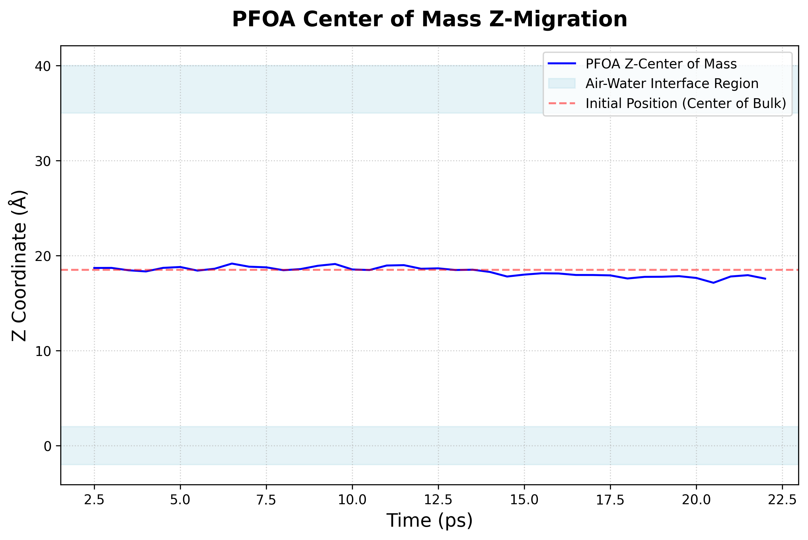

# Observation: PFOA Z-Axis Movement and Stagnation

**Date**: March 9, 2026
**Simulation**: PFOA at Air-Water Interface (`pfoa_in_water_test.lammps`)

## The Observation
During a 22,000 timestep (22 ps) beta test of the `pfoa_in_water_test.lammps` simulation, the output from `com.dat` indicated that the PFOA molecule's Z-coordinate fluctuated between **17.5 Å and 19.0 Å** and appeared stagnant.

## The Cause
1. **Initial Placement**: The command used to insert PFOA was:
   ```lammps
   read_data data/PFOA_stripped.data add append offset ... shift 18.636 18.636 18.5
   ```
   This placed the PFOA exactly at **Z=18.5 Å**, which is the dead-center of the 37 Å bulk water slab.

2. **Slab Geometry vs Periodicity**: When the box was expanded in the Z-direction to 250 Å (`change_box all z final 0 250.0 units box`), LAMMPS did *not* center the water slab. The water remained effectively positioned from Z=0 to Z=37. This means the vacuum gap resides entirely between Z=37 and Z=250. 
   
3. **Diffusion Timescale**: 22 ps is an extremely short time in molecular dynamics. Because PFOA was initialized deep within the bulk water, it did not have enough time to naturally diffuse to the air-water interfaces located at Z=0 or Z=37.
   
   

## Resolution Options

### Option 1: Increasing the Timestep (Not Recommended)
While it is technically possible to increase the simulation time to wait for the molecule to randomly diffuse to the surface:
* **The Problem**: A random walk from the center of the water slab (Z=18.5) to the interface (Z=37) takes about ~1 to 5 nanoseconds (equivalent to 1,000,000 to 5,000,000 timesteps). 
* Running simulations for that long just to get the molecule to the starting line of the interface is computationally extremely expensive and inefficient.

### Option 2: Place PFOA Closer to the Interface (Highly Recommended)
In Molecular Dynamics interface simulations, the standard practice is to manually place the solute molecule just below the interface. The goal is to place it close enough that it reaches the surface quickly, but *deep enough* that it is fully solvated by bulk water initially (to avoid unnatural starting conformations in a vacuum).

* The water slab exists from **Z=0 to Z=37**.
* The interface boundary region occurs roughly between **Z=35 and Z=37**.
* PFOA is approximately **10-12 Å long**.

**Conclusion & Next Steps**
To ensure the molecule is fully immersed in water but only a few Angstroms away from the surface, the optimal insertion Z-coordinate is **Z = 30 to Z = 32 Å**. At Z=32 Å, the molecule is safely 3-5 Å deep inside the bulk water but only needs to diffuse a short distance to penetrate the interface, which will happen within a few tens of picoseconds.

The PFOA insertion command in `src/pfas/pfoa_in_water.lammps` should be updated to:
```lammps
read_data data/PFOA_stripped.data add append offset 2 1 1 0 0 shift 18.636 18.636 32.0
```
